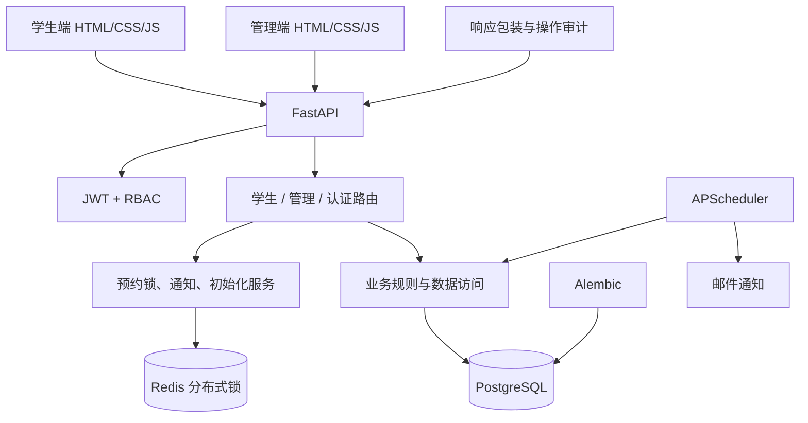
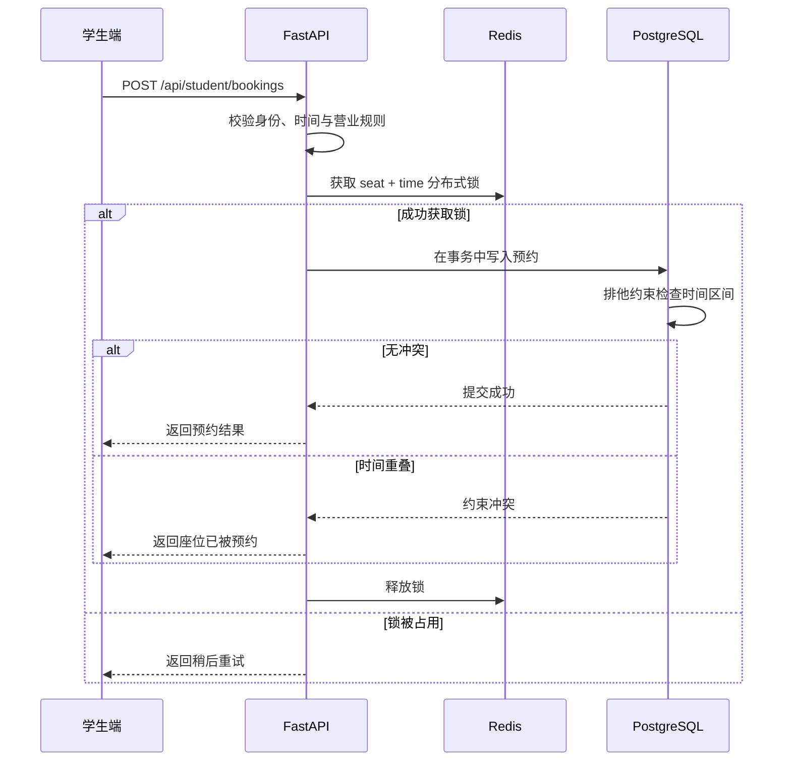
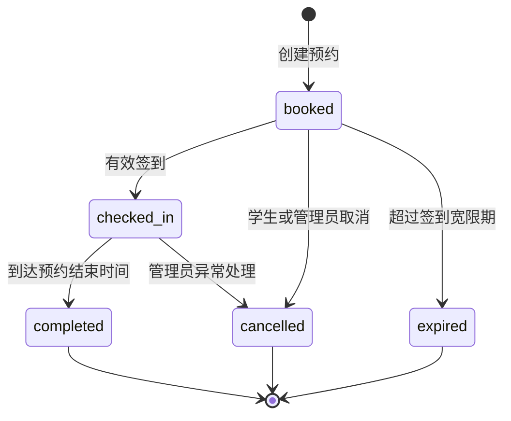

# 自习室管理系统架构说明

## 系统架构

## 并发预约时序

## 预约状态机

## 可靠性边界

- Redis 锁用于降低同一座位同一时段的并发竞争，PostgreSQL 排他约束作为最终一致性防线。
- JWT Access/Refresh Token 与 RBAC 隔离学生、员工、管理员和超级管理员权限。
- 定时任务负责预约过期、自动完成、提醒与邮件发送；重复执行必须保持幂等。
- 管理员操作日志对密码、Token、Secret 和 API Key 等字段脱敏。
- 生产环境禁止默认 JWT 密钥和自动创建演示账号。
